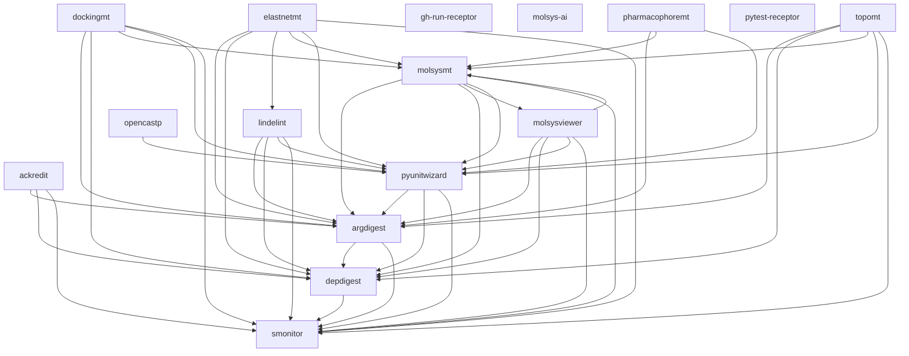

# MolSysSuite component dependencies

Generated from `suite.toml`; edit the registry and run
`python devtools/scripts/dependency_graph.py --write`. Check with `--check`.
See [the dependency graph policy](dependency_graph_policy.md) for scope, evidence,
selectors and exception profiles. Arrows mean **consumer requires provider**.
This inventory is inspected source, not installed compatibility certification.

## Required runtime graph

## Provider-first layers

A bracketed group is one strongly connected unit; its members have no safe
internal topological order. Layers do not authorize releases or replace #27.

| Layer | Components / coordinated units |
| --- | --- |
| 1 | gh-run-receptor; molsys-ai; pytest-receptor; smonitor |
| 2 | depdigest |
| 3 | argdigest |
| 4 | ackredit; pyunitwizard |
| 5 | lindelint; [molsysmt, molsysviewer]; opencastp |
| 6 | dockingmt; elastnetmt; pharmacophoremt; topomt |

Runtime cycles: molsysmt, molsysviewer.

## All typed direct relationships

| Consumer | Kind | Providers |
| --- | --- | --- |
| ackredit | ci-tooling | gh-run-receptor |
| ackredit | documentation-tooling | argdigest, depdigest, smonitor |
| ackredit | runtime | argdigest, depdigest, smonitor |
| ackredit | test-tooling | argdigest, depdigest, pytest-receptor, smonitor |
| argdigest | ci-tooling | gh-run-receptor |
| argdigest | documentation-tooling | depdigest, smonitor |
| argdigest | runtime | depdigest, pyunitwizard (optional: all, pyunitwizard), smonitor |
| argdigest | test-tooling | depdigest, pytest-receptor, pyunitwizard, smonitor |
| depdigest | ci-tooling | gh-run-receptor |
| depdigest | documentation-tooling | smonitor |
| depdigest | runtime | smonitor |
| depdigest | test-tooling | pytest-receptor, smonitor |
| dockingmt | ci-tooling | gh-run-receptor |
| dockingmt | runtime | argdigest, depdigest, molsysmt, molsysviewer (optional: viewer), pyunitwizard, smonitor |
| dockingmt | test-tooling | depdigest, pytest-receptor, pyunitwizard, smonitor |
| elastnetmt | ci-tooling | gh-run-receptor |
| elastnetmt | documentation-tooling | lindelint, molsysmt, pyunitwizard |
| elastnetmt | runtime | argdigest, depdigest, lindelint, molsysmt, pyunitwizard, smonitor |
| elastnetmt | test-tooling | molsysmt, pytest-receptor, pyunitwizard |
| gh-run-receptor | test-tooling | pytest-receptor |
| lindelint | ci-tooling | gh-run-receptor |
| lindelint | documentation-tooling | argdigest, depdigest, pyunitwizard, smonitor |
| lindelint | runtime | argdigest, depdigest, pyunitwizard, smonitor |
| lindelint | test-tooling | argdigest, depdigest, pyunitwizard, smonitor |
| molsysmt | ci-tooling | gh-run-receptor |
| molsysmt | documentation-tooling | argdigest, depdigest, pyunitwizard, smonitor |
| molsysmt | runtime | argdigest, depdigest, molsysviewer, pyunitwizard, smonitor |
| molsysmt | test-tooling | pytest-receptor |
| molsysviewer | ci-tooling | gh-run-receptor |
| molsysviewer | documentation-tooling | argdigest, depdigest, molsysmt, pyunitwizard, smonitor |
| molsysviewer | runtime | argdigest, depdigest, molsysmt, pyunitwizard, smonitor |
| molsysviewer | test-tooling | argdigest, depdigest, molsysmt, pytest-receptor, pyunitwizard, smonitor |
| opencastp | ci-tooling | gh-run-receptor |
| opencastp | runtime | pyunitwizard |
| opencastp | test-tooling | pytest-receptor, pyunitwizard |
| pharmacophoremt | ci-tooling | gh-run-receptor |
| pharmacophoremt | documentation-tooling | molsysmt, pyunitwizard |
| pharmacophoremt | runtime | argdigest, molsysmt, pyunitwizard |
| pharmacophoremt | test-tooling | molsysmt, pytest-receptor, pyunitwizard |
| pytest-receptor | ci-tooling | gh-run-receptor |
| pyunitwizard | ci-tooling | gh-run-receptor |
| pyunitwizard | documentation-tooling | depdigest, smonitor |
| pyunitwizard | runtime | argdigest, depdigest, smonitor |
| pyunitwizard | test-tooling | argdigest, depdigest, pytest-receptor, smonitor |
| smonitor | ci-tooling | gh-run-receptor |
| smonitor | test-tooling | pytest-receptor |
| topomt | ci-tooling | gh-run-receptor |
| topomt | documentation-tooling | argdigest, depdigest, molsysmt, pyunitwizard, smonitor |
| topomt | runtime | argdigest, depdigest, molsysmt, molsysviewer (optional: viewer), pyunitwizard, smonitor |
| topomt | test-tooling | argdigest, depdigest, molsysmt, pytest-receptor, pyunitwizard, smonitor |

Only observed direct relationships are recorded. In particular, a synchronized
guide copy, optional import or platform architecture reference does not create a
package dependency. MolSys-AI is a governed subsystem without a Python manifest;
its child implementation repositories are outside this registered-member graph.
